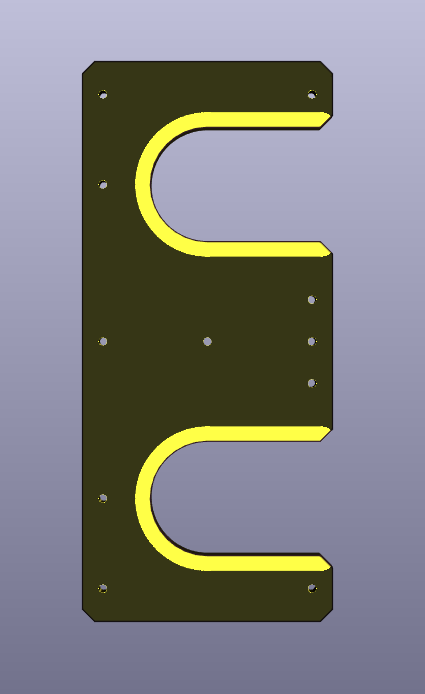

[](https://github.com/PatrickBaus/Owner-avatar-HP6632B_shorting_bar/actions/workflows/ci.yml)
# HP 66332A and HP 6632B-6634B Shorting Bar
This repository contains the schematics for a small PCB shorting bar for the [HP 6632B](https://www.keysight.com/us/en/product/6632B/100-watt-system-power-supply-20v-5a.html) (and siblings) power supply. This PCB is to be used in conjunction with [HP 66332A and HP 6632B-6634B Frontpanel Binding Post PCB](https://github.com/PatrickBaus/HP6632B_binding_posts) project to short the sense output to the regular outputs if a four wire connection is not desired.



## Contents
- [Introduction](#introduction)
- [Design Files](#design-files)
- [Related Repositories](#related-repositories)
- [Versioning](#versioning)
- [License](#license)

## Introduction
The [HP 66332A and HP 6632B-6634B Frontpanel Binding Post PCB](https://github.com/PatrickBaus/HP6632B_binding_posts) front panel PCB breaks out both the sense and force terminals of the [HP 6632B](https://www.keysight.com/us/en/product/6632B/100-watt-system-power-supply-20v-5a.html). Normally, only the force terminals are required on the bench. This PCB is a cost-effective solution to short the sense terminals to the force terminals directly at the outpout of the power supply. Two PCBs are required to short both the positive and the common terminals.

I used a ```1 mm``` PCB which was ```ENIG``` plated to make sure no corrosion builds up on the surface.

## Design Files
The root folder contains the KiCAD files. The bill of materials can be found on the [releases](../../releases) page along with Gerber files for production.

## Related Repositories
See the following repositories which contain addional optional parts

- [HP 66332A and HP 6632B-6634B Frontpanel Binding Post PCB](https://github.com/PatrickBaus/HP6632B_binding_posts)

## Versioning
I use [SemVer](http://semver.org/) for versioning. For the versions available, see the [tags](../../tags) available for this repository.

- MAJOR versions in this context mean a breaking change to the external interface of the hardware like different connectors or functions.
- MINOR versions contain changes to the hardware that only affect the inner workings of the circuit, but otherwise the performance is unaffected.
- PATCH versions do not affect the schematics or invalidate older bill of materials. These changes may include updated components (to replace obsolete parts for example), an updated silkscreen, or fixed typos.

## License
This work is released under the CERN-OHL-W
See [https://ohwr.org/cern_ohl_w_v2.pdf](https://ohwr.org/cern_ohl_w_v2.pdf) or the included LICENSE file for more information.
